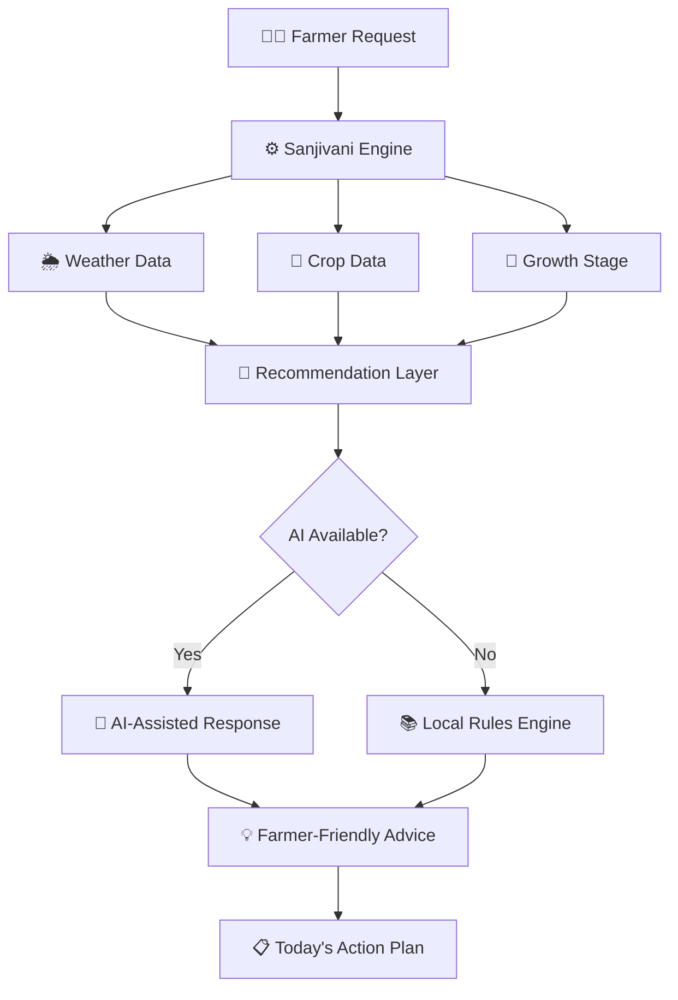
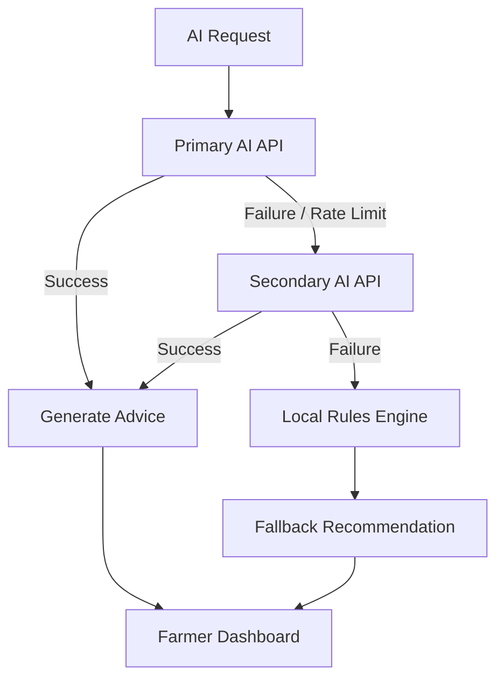
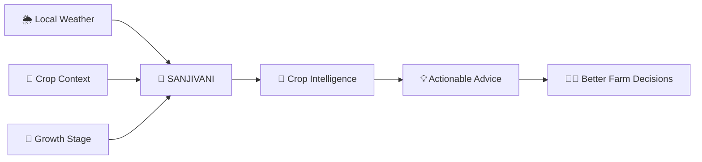

# 🌱 Sanjivani — Intelligent Crop Companion

> ### **Localized Weather. Crop Intelligence. Better Decisions.**

Sanjivani is a farmer-centric digital crop companion designed to provide **localized weather intelligence and crop-specific recommendations** throughout the crop lifecycle.

Instead of simply displaying weather forecasts, Sanjivani combines **field location, live weather, crop information, and crop growth stage** to convert agricultural data into simple, actionable recommendations for farmers.

The core idea is simple:

> **Weather tells you what is happening. Sanjivani tells you what it means for your crop.**

---

## 🎯 Problem Statement

Farmers often receive weather forecasts and agricultural information from multiple sources, but raw information does not always translate into an immediate farm decision.

A farmer does not simply need to know:

> 🌧️ *"Rain is expected today."*

They need to know:

> 💧 *"What does this rain mean for my crop, and should I irrigate today?"*

Several factors influence the correct decision:

- 📍 Location of the field
- 🌦️ Local weather conditions
- 🌱 Crop type
- 🌼 Current crop growth stage
- 💧 Irrigation method
- 🧪 Soil conditions
- ⚠️ Crop-health risks

Sanjivani brings these factors together into a single farmer-friendly platform.

---

# 💡 Our Solution

Sanjivani follows the farmer's crop from **seed to harvest** and continuously converts crop context into meaningful daily actions.

```mermaid
flowchart TD
    A[👨‍🌾 Farmer] --> B[📍 Field Location]
    B --> C[🌦️ Localized Weather]
    C --> D[🌱 Crop Context]
    D --> E[🌼 Current Growth Stage]
    E --> F[🧠 Recommendation Engine]
    F --> G[💡 Crop Impact]
    G --> H[📋 Actionable Advice]
    H --> I[✅ Today's Crop Plan]
````

### Core Intelligence

```text
Field Location
      +
Live Weather
      +
Crop
      +
Growth Stage
      +
Agricultural Rules
      ↓
Crop-Specific Interpretation
      ↓
Simple Recommendation
      ↓
Farmer Action
```

---

# 🌦️ Core Feature — Localized Weather Intelligence

Sanjivani uses the farmer's field location to retrieve localized weather information.

The application can use the browser's native Geolocation API:

```javascript
navigator.geolocation.getCurrentPosition(...)
```

The resulting latitude and longitude are used to retrieve weather data.

### Weather information includes:

* 🌡️ Temperature
* 💧 Relative humidity
* 🌧️ Precipitation
* ☔ Rain probability
* 💨 Wind speed
* 🌤️ Weather condition
* 📅 Daily forecast
* 🌱 Reference evapotranspiration (ET₀)

Weather data is integrated using the **Open-Meteo Weather Forecast API**.

---

# 🌱 Crop-Aware Recommendations

The most important part of Sanjivani is that **weather is not treated as the final recommendation**.

The system combines weather with crop context.

### Example

```text
Location
   ↓
Nashik, Maharashtra

Weather
   ↓
Rain expected

Crop
   ↓
Tomato

Growth Stage
   ↓
Flowering

Recommendation
   ↓
💧 HOLD IRRIGATION
```

### Explanation

> Rain is expected near the field and the tomato crop is currently in the flowering stage, so irrigation should be reviewed before applying additional water.

This transforms:

```text
RAW WEATHER
     ↓
CONTEXT
     ↓
UNDERSTANDING
     ↓
ACTION
```

---

# 🧠 Hybrid Intelligence Architecture

Sanjivani uses a combination of **AI assistance and deterministic agricultural rules**.



This architecture reduces dependency on a single external AI service.

If an AI service becomes unavailable or reaches its rate limit, the local rules engine can continue providing deterministic recommendations for supported scenarios.

---

# ✨ Key Features

| Feature              | Purpose                                         |
| -------------------- | ----------------------------------------------- |
| 🌦️ Local Weather    | Field-specific weather information              |
| 📍 Geolocation       | Automatically identify field coordinates        |
| 🌱 Crop Management   | Manage multiple crops and fields                |
| 🌼 Crop Journey      | Track crop development from seed to harvest     |
| 📋 Today's Plan      | Show prioritized daily actions                  |
| 💡 Why & How         | Explain the reasoning behind actions            |
| 🩺 Plant Check       | Record crop observations and photographs        |
| 🧪 Soil Intelligence | Interpret NPK and pH information                |
| 💰 Farm Ledger       | Track expenses and harvest information          |
| 📊 Reports           | View crop and farm history                      |
| 🤖 AI Assistance     | Generate natural-language agricultural guidance |
| 🔄 Fallback Engine   | Maintain functionality during API failures      |

---

# 🌾 Crop Journey

Sanjivani represents crop development as a visual lifecycle.


The crop stage is determined using crop-specific lifecycle information and sowing/transplanting dates.

This allows recommendations to become **stage-aware** instead of being completely generic.

---

# 📋 Today's Crop Plan

The Today dashboard focuses on one simple question:

> ## **"What should I do today?"**

Example:

```text
🌱 TOMATO — DAY 47
🌼 FLOWERING

THREE THINGS FOR TODAY

01  Inspect flowers
02  Check soil moisture
03  Review today's weather

🌦️ WEATHER CHANGE
Rain is expected today.

💧 SANJIVANI'S ADVICE
Hold irrigation for now.

WHY?
Rain is expected near your field and
your crop is currently flowering.
```

The interface is designed to reduce information overload and prioritize actions.

---

# 🏗️ Technology Stack

### Frontend

* React 19
* React Router
* Tailwind CSS
* Vite
* Lucide Icons

### Data & Intelligence

* JSON-based crop configurations
* Rule-based recommendation engine
* Crop-stage resolver
* AI-assisted recommendations
* Local fallback logic

### APIs

* Open-Meteo Weather Forecast API
* Browser Geolocation API
* AI API provider

### Storage

The prototype uses browser-based storage for:

* Farmer information
* Field information
* Crop information
* Logs
* Preferences
* Cached recommendations

---

# 📁 Project Structure

```text
sanjivani-web/
│
├── public/
│   └── icons/
│
├── src/
│   ├── data/
│   │   ├── crops/
│   │   │   ├── tomato.json
│   │   │   └── wheat.json
│   │   │
│   │   ├── rules/
│   │   │   ├── irrigationRules.json
│   │   │   ├── fertilizerSchedule.json
│   │   │   └── diseaseRiskRules.json
│   │   │
│   │   └── mockWeather.json
│   │
│   ├── engine/
│   │   ├── stageResolver.js
│   │   ├── adviceGenerator.js
│   │   └── weeklySummaryBuilder.js
│   │
│   ├── store/
│   │   ├── farmStore.js
│   │   └── logStore.js
│   │
│   ├── components/
│   │   ├── layout/
│   │   ├── today/
│   │   ├── journey/
│   │   ├── plantCheck/
│   │   ├── reports/
│   │   └── ui/
│   │
│   ├── pages/
│   │   ├── Onboarding.jsx
│   │   ├── TodayPage.jsx
│   │   ├── JourneyPage.jsx
│   │   ├── WeeklyReportPage.jsx
│   │   └── HistoryPage.jsx
│   │
│   ├── hooks/
│   │   ├── useCropStage.js
│   │   └── useTodayAdvice.js
│   │
│   ├── App.jsx
│   └── main.jsx
│
├── index.css
├── package.json
├── vite.config.js
└── README.md
```

---

# 🚀 Installation & Setup

### 1. Clone the repository

```bash
git clone <YOUR_REPOSITORY_URL>
cd sanjivani-web
```

### 2. Install dependencies

```bash
npm install
```

### 3. Configure environment variables

Create a `.env` file if required by your configured AI service:

```env
VITE_AI_API_KEY=your_api_key_here
```

> ⚠️ Never commit API keys or secrets to GitHub.

Add `.env` to `.gitignore`.

### 4. Start the development server

```bash
npm run dev
```

Open the local URL provided by Vite, usually:

```text
http://localhost:5173
```

---

# 🔐 Reliability & Fallback Strategy

Sanjivani is designed to avoid complete failure when an external service becomes unavailable.



The system can additionally use recommendation caching to reduce repeated API requests.

---

# 🧑‍🌾 Hackathon Demo Flow

Our recommended SIH demonstration follows a single farmer and crop.

```text
👨‍🌾 Farmer
     ↓
📍 Select Field Location
     ↓
🌱 Select Tomato Crop
     ↓
📅 Enter Sowing Date
     ↓
🌼 Determine Current Stage
     ↓
🌦️ Fetch Local Weather
     ↓
🧠 Interpret Weather + Crop
     ↓
💡 Generate Recommendation
     ↓
📋 Show Today's Actions
     ↓
✅ Farmer Takes Action
```

### Example Demo Profile

```text
Farmer       : Ramesh Patil
Location     : Nashik, Maharashtra
Crop         : Tomato
Field        : Field A
Area         : 1 acre
Crop Day     : 47
Stage        : Flowering
Irrigation   : Drip
Soil         : Loamy
```

---

# 🔮 Future Roadmap

### Phase 1 — MVP

* Localized weather
* Crop-stage intelligence
* Actionable recommendations
* AI assistance
* Rule-based fallback

### Phase 2 — Agricultural Intelligence

* More crop models
* Regional crop calendars
* Improved disease-risk intelligence
* Soil-aware recommendations
* Historical weather analysis

### Phase 3 — Farmer Ecosystem

* Regional languages
* Voice-based interaction
* Government scheme discovery
* Mandi price integration
* Expert/KVK connectivity
* SMS/WhatsApp notifications

### Phase 4 — Advanced Intelligence

* Yield prediction
* Crop-risk prediction
* Satellite data
* Remote sensing
* Personalized farm models
* Continuous learning from farmer observations

---

# 🌍 Scalability

The system follows a modular crop configuration architecture.

```text
Crop
 ├── Growth Stages
 ├── Irrigation Rules
 ├── Nutrition Schedule
 ├── Risk Conditions
 └── Recommendation Logic
```

New crops can therefore be added without redesigning the entire application.

The same architecture can be extended from one crop and region to multiple crops and agricultural regions.

---

# ⚠️ Responsible Use

Sanjivani is a **decision-support prototype** developed for hackathon demonstration and experimentation.

AI-generated or rule-based recommendations should be treated as advisory information and should be validated against:

* Local agricultural practices
* Crop variety
* Soil conditions
* Weather conditions
* Regional agricultural advisories
* Professional agricultural guidance

Plant-health image analysis should be treated as a possible indication rather than a confirmed diagnosis.

---

# 🌱 Our Vision

Sanjivani is built around one simple principle:

> ## **Right Action. Right Time. Right Amount.**

We do not aim to replace the farmer's knowledge.

We aim to bring the right information together at the right time and transform complex agricultural information into a decision that farmers can understand and act upon.



---

## ❤️ Sanjivani

### **Your crop has a journey. Let Sanjivani walk with it. 🌱**

**Built for farmers • Built for smarter decisions • Built for a more resilient agricultural future**

```
